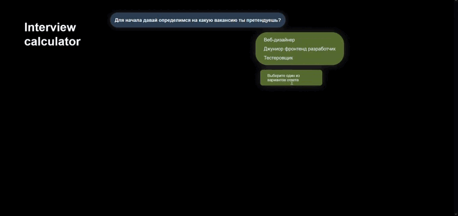
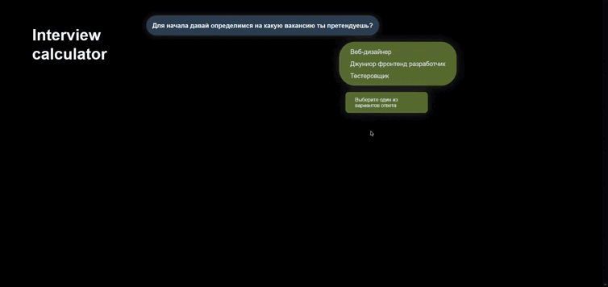
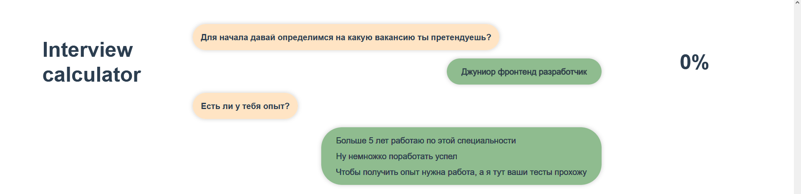
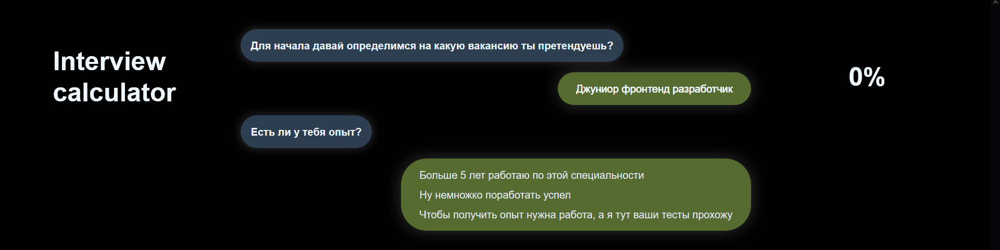

<h1>Interview calculator 🧮</h1><br/>
[Test the functionality in demo.](https://azzimandias.github.io/interview-calculator/)<br/>
(not stable version)<br/>
Interview calculator web application. Implemented using the Vue framework.<br/>

---
<h2 align="center"> Project description </h2>

### You can choose the answer options


---
### The probability of success in the interview 
### dynamically changes depending on the chosen answer


---
### There are unfinished answer options that go back
 

---
### At the end of the interview, the result appears
 
---

## Themes

### Switch depending on the system setting

### light

### dark


---

<h2 align="center"> Project setup </h2>

```
npm install
```

### Compiles and hot-reloads for development
```
npm run serve
```

### Compiles and minifies for production
```
npm run build
```

### Customize configuration
See [Configuration Reference](https://cli.vuejs.org/config/).
